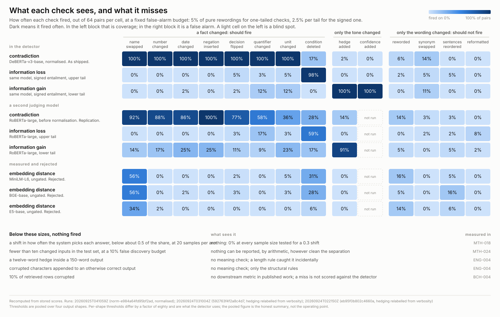

# a-prime

## The problem

You swap the model behind an LLM feature. Perhaps you move to something cheaper,
perhaps your provider retires the snapshot you were pinned to, perhaps you bump a
local model by one version. Your unit tests still pass, because they test your
code rather than the model's judgement. You have no labelled data for your own
domain, because almost nobody does. And every output now reads slightly
differently, because the new model phrases things its own way.

So how do you find out what actually broke?

Most teams read fifty outputs and hope. That is not carelessness, it is the
absence of anything better. Across 118 incidents published by the two largest
model providers, not one describes a drop in output quality. Quality regressions
in the wild have run from four days to ten months before anyone noticed them, and
in the cases that have been written up, none was caught by the operator's own
automated tests.

a-prime is an attempt at something better. Give it your old system, your new
system, and a few hundred of your own inputs. It tells you which inputs changed
behaviour, and how often it is likely to be wrong when it says so.

It does that without knowing what your outputs mean. No labels, no reference
answers, no assertions to write by hand.

## The idea: run the baseline twice

The hard part is not spotting differences. Differences are everywhere, because a
new model rewords everything. The hard part is knowing which differences matter,
and that needs a sense of how much variation is normal.

So before comparing the old system to the new one, a-prime runs **the old system
against itself**, a second time:

```
                    ┌──► A   (old system)  ─┐
  your inputs  ─────┼──► A′  (old system,   ─┼──► A vs B  : did the new one differ?
                    │        again)          │
                    └──► B   (new system)  ─┘    A vs A′ : how much does the old
                                                           one differ from itself?
```

The second run, `A′`, is a comparison where nothing changed by construction. Any
difference it shows is pure noise. That gives a yardstick: a difference between
the old and new systems only counts if it is bigger than the difference the old
system shows against itself.

This is what makes the false alarm rate knowable. You choose a budget, say "at
most 10% of what you flag may be a false alarm", and the second baseline run
tells the tool where to put its threshold to honour that. There is no
distributional assumption, no p-value, and nothing to calibrate by hand.

The measurement that matters is whether that promise holds. On a synthetic
system where we know exactly which inputs really changed, asking for at most
10% false alarms produced **3.4%**, while still catching **28 of the 30** inputs
that genuinely changed.

```bash
python scripts/demo_detect.py
```

```
a-prime report: 29 of 300 inputs flagged at q=0.1

channels:
  mode_share       28 flagged   short: n=300 thr=0.583 found=28
  novel_mode       13 flagged   short: n=300 thr=0.500 found=13
  dispersion        0 flagged   short: n=300 thr=inf   found=0
  embedding     skipped - no embedder supplied

conformance: 8 candidates -> 7 hard, 0 surfaced, 1 discarded

flagged inputs:
  in025 [short] mode_share=+1.000, novel_mode=+1.000
  in030 [short] mode_share=+1.000, novel_mode=+1.000
  ...
```

Note the `dispersion` line. That check found no threshold it could justify, so it
reported nothing rather than lowering its bar until something appeared. A tool
that always finds something is not measuring anything.

## What we found, including the parts that did not work

The results below come from 896 hand-built text pairs where we know the intended
relationship between the two versions. Some pairs say the same thing in different
words. Others change a number, flip a decision, or quietly drop a condition. A
good check catches the second kind and ignores the first.

Several checks run in parallel, and none of them votes. Each reports separately,
because combining them would need weights, and weights we invented would be
weights nobody could audit.

| check | what it catches | what it misses |
|---|---|---|
| contradiction | 7 of 8 kinds of factual change, 84% to 100% of the time | dropped conditions, completely |
| information loss | dropped conditions, 98% | everything else |
| information gain | added content such as hedging, 100% | everything else |
| structural rules | broken JSON, wrong alphabets, answers cut mid-sentence, refusals | anything about meaning |
| embedding distance | **less than nothing, if used naively** | see below |

The same results as a picture. Each cell is how often a check fired on one kind
of change, out of 64 test pairs, at a false-alarm budget of 5%. Dark cells on
the left are coverage; dark cells on the right are false alarms; a light cell
on the left is a blind spot. The grid compares three judging models on the
same text; the block under it is the configuration the tool ships with, where
text is normalised before judging, and the difference between the two is what
that normalisation buys. The last block lists the changes that were too small
for anything to see.



The first three use a model trained to judge whether one piece of text follows
from another. The fourth reads no meaning at all, which is exactly why it covers
failures the others cannot see: a corrupted character is not a claim, so no
amount of reading comprehension will notice it.

### The result we did not expect

**Embedding distance is worse than useless here.** Embeddings turn text into
vectors so that similar text sits close together, and comparing those vectors is
the obvious way to ask whether an output changed. We tried it across three
different embedding model families, and in all three it performed at or below a
coin flip.

The reason is mundane once you see it. Rewriting a sentence moves its vector
about **twenty times further** than changing a number, a date, or a negation
inside it. So the measure reliably reports that harmless rewording is a big
change and that a flipped decision is a small one.

It recovers only when the new system happens to phrase things much like the old
one. So it ships behind a check that measures whether that is true, and switches
the whole thing off when it is not. A measure that performs below chance is worse
than having none, because someone will believe it.

## Two ideas that might be useful elsewhere

**The second baseline run does a second job.** As well as setting the false alarm
rate, it filters rules.

a-prime infers rules about your output by watching your baseline produce it. If
every one of 300 baseline outputs is valid JSON, contains a `status` field, and
uses only Latin characters, those become rules, and the new system is checked
against them. This idea is borrowed from Daikon, a program analysis tool from
2001 that watched software run and guessed the invariants its variables obeyed.
Nobody seems to have applied it to the text a language model produces.

Daikon's well known weakness is that it proposes far more rules than a person
can review, most of them true by coincidence. The second baseline run handles
that: a rule that holds for one run of a system and breaks on another run of the
same system was never really a rule. What survives both runs is enforced
automatically. What holds most of the time but not always is shown to a human as
a question, phrased as "this was true in 87% of outputs, is that a rule or just
usual variation?". The rest is discarded.

**One number, read at both ends, names two different faults.** When we ask
whether the old output implies the new one and vice versa, the asymmetry is
informative. A strongly positive value means the new output says less than the
old one, which is content going missing. A strongly negative value means it says
more, such as hedging that was not there before. The sign tells you which
happened. Our first implementation took the absolute value, which collapsed both
cases into one and threw away the only part that identified the fault.

## Honest limits

- **The tool cannot report fewer than ten changed inputs at its default
  setting, so a single broken behaviour comes back as an empty report.** The
  false alarm estimate is built by counting how many inputs cleared the bar, and
  it is deliberately pessimistic: it adds one imaginary false alarm before
  dividing, so that a lucky run cannot claim perfection. When ten inputs are
  reported, that one imaginary alarm comes to exactly the 10% false alarm rate
  the default asks for. When one input is reported, the same arithmetic gives
  100%, so the tool says nothing rather than hand you a finding it cannot stand
  behind. Two practical consequences follow. An empty report means "fewer than
  ten inputs changed", which is not the same as "nothing changed", and the two
  cannot be told apart. And your test set has to be large enough that at least
  ten of its inputs genuinely do change when the system does, which for a
  change that only affects one request in five means at least fifty inputs. If
  what you need is to catch one specific broken input, compare that input's
  outputs directly and do not use this.

- **Twenty samples from each system is the real minimum, which works out to 60
  model calls for every input you test.** Distinguishing a genuine change from
  random variation needs several samples from each of the three runs: the old
  system, the old system again, and the new one. At ten samples per run the tool
  detected only 8% of moderate changes. At twenty it reached 73%. Budget for
  twenty, which is sixty calls per input across the three runs.

- **Small changes are invisible, and we can say roughly how small.** If the new
  system still produces the same set of possible answers but shifts how often it
  picks each one by around 30%, nothing we tried detected it at any sample size.
  A tool that cannot see a change should say where its floor is rather than imply
  complete coverage.

- **The figures describe our setup, not the technique.** Most checks depend on a
  model trained to judge whether one piece of text follows from another.
  Substituting a different model of the same kind reproduced the direction of
  every finding and none of the magnitudes, with gaps of up to 48 percentage
  points on individual categories. Anyone reusing this should re-measure with
  their own judge.

- **Duplicate inputs are only removed when the wording matches.** After
  normalising case and formatting, identical text collapses to a single entry;
  two different phrasings of the same question do not. This matters because the
  false alarm guarantee is computed by counting inputs, so undetected duplicates
  make the evidence look more independent than it is and the guarantee slightly
  optimistic.

- **One threshold was set by judgement rather than measurement**: the one
  deciding whether the embedding comparison is trustworthy for a given pair of
  systems. It is marked as a guess in the code. Set too loosely it admits a
  measure known to perform below chance; set too tightly it contributes nothing.

- **Nothing here has run against a production system.** Every figure comes from
  a synthetic system whose correct answers we control, or from hand-built text
  pairs where we know the intended relationship. This is research in progress
  rather than a tool with a track record.

## Prior art

This is not an empty field, and one project got to the core idea first.

[Clausius](https://github.com/beatakouchnir/clausius) detects regressions without
labels, using a measured baseline for comparison, and has published sensitivity
figures. It reads the model's internal token probabilities, which means it only
works with models you host yourself and cannot be pointed at a commercial API.
a-prime looks only at the text that comes out, which is slower and less
informative but works anywhere.

[Inspect](https://inspect.aisi.org.uk/), from the UK AI Safety Institute, already
has the statistics right, including repeated sampling and the correct error bars
for comparing two models. It is a framework you configure for each evaluation you
write, rather than something that infers what to check.

[Giskard](https://github.com/Giskard-AI/giskard) generates tests from
transformations that should not change an answer, such as rephrasing a question.
Arize Phoenix groups outputs by meaning and ranks the groups by how much they
have drifted.

What appears not to exist yet: inferring structural rules from a baseline's own
output, and using a repeated baseline run as a general purpose way to calibrate a
black box comparison.

## Repository layout

```
src/aprime/        the library
docs/knowledge/    what is currently true, one file per component
docs/*/LEDGER.md   findings, each with its evidence and what would overturn it
HANDOFF.md         why the design is the way it is
```

Good entry points are
[`docs/knowledge/probes.md`](docs/knowledge/probes.md), which lists what each
check can and cannot see, and
[`docs/knowledge/detector.md`](docs/knowledge/detector.md), which explains how
the pieces fit together.

```bash
python -m pytest tests/ -q     # 134 tests, no model downloads required
```

## Licence

The code is under [Apache 2.0](LICENSE). The documentation and the measured
results are under [CC BY 4.0](https://creativecommons.org/licenses/by/4.0/),
which asks for attribution if you quote the numbers. See [NOTICE](NOTICE).
